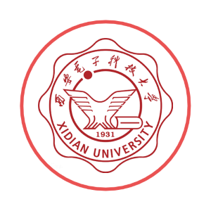

<!-- _coverpage.md -->
<!-- markdownlint-disable MD033 MD041 -->

# nonebot_plugin_xdu_support

<!-- prettier-ignore-start -->
<!-- markdownlint-disable-next-line MD036 -->
_✨ 基于nonebot的XDU服务插件 ✨_
<!-- prettier-ignore-end -->

    
    
    

[GitHub](https://github.com/longchengguxiao/nonebot_plugin_xdu_support)
[Get Started](#说在前面)